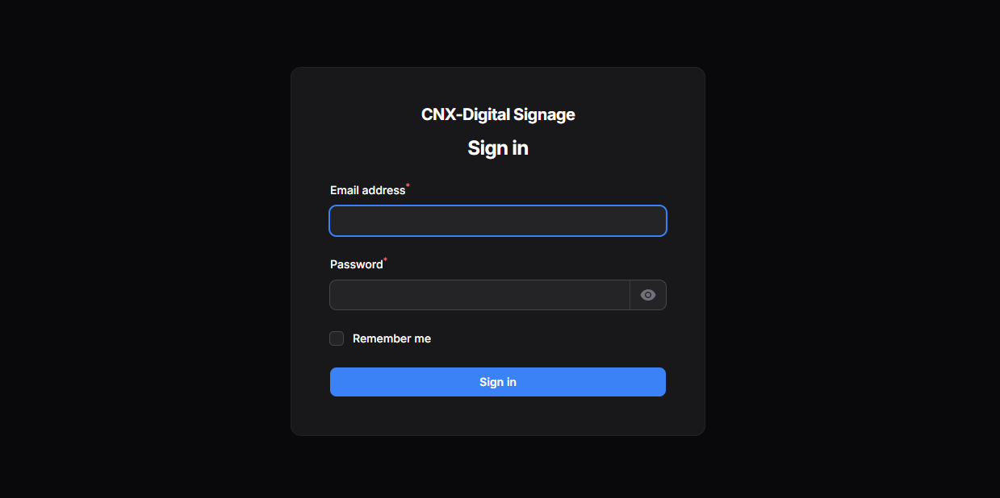
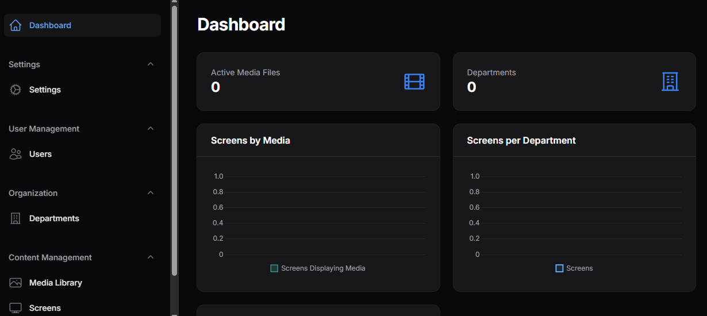
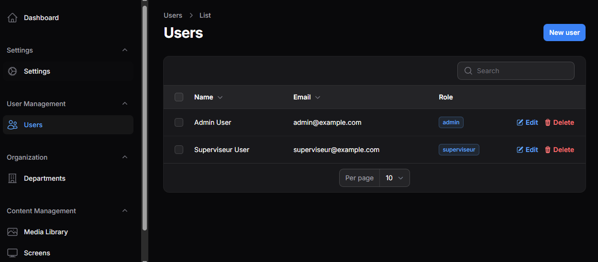

# 🖥️ CNX-Digital Signage System

A custom digital signage system built with Laravel, designed for internal use 
in organizations like **Algérie Télécom** to manage and display media content 
across screens in multiple departments and zones.

---

## 📌 Features

- 🎯 **Department & Zone Management** — Organize screens by department and zone
- 📺 **TV Screen Management** — Register and configure screens to receive media
- 📂 **Media Library** — Upload and categorize images, videos, or dynamic content
- ⏱️ **Scheduled Display** — Control when and where media appears
- 📊 **Dashboard & Analytics** — Monitor screen usage via a real-time dashboard
- 🔒 **Role-based Access Control** — Admins and supervisors have separate permissions

---

## 📸 Screenshots

### Login


### Dashboard


### User Management


---

## ⚙️ Tech Stack

- **Backend**: Laravel 10+, PHP
- **Admin Panel**: Filament PHP
- **Database**: MySQL / MariaDB
- **Frontend**: Blade, Livewire

---

## 🚀 Installation

```bash
git clone https://github.com/zachlethal/digital-signange-system.git
cd digital-signange-system
composer install
cp .env.example .env
php artisan key:generate
php artisan migrate --seed
php artisan serve
```
